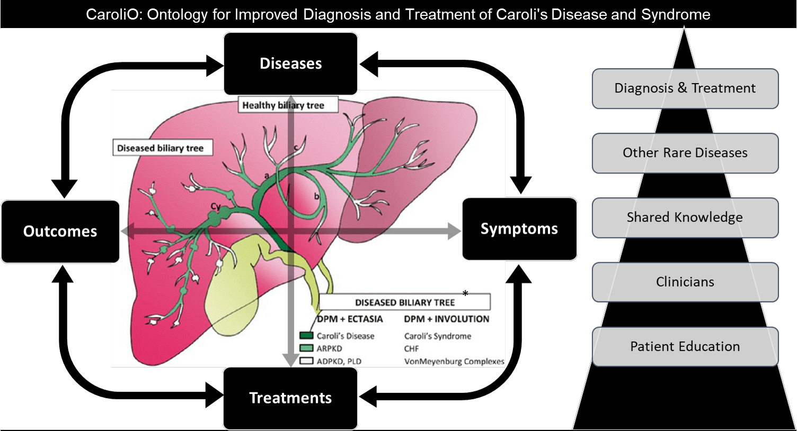

# CaroliO

We present CaroliO, an ontology for Caroli's disease and syndrome, aimed at enhancing the diagnosis and treatment of these rare liver conditions. Our work addresses the pressing need for structured knowledge resources in the field of rare diseases, which often present significant diagnostic and treatment challenges due to limited information.

We developed our ontology in two versions: CaroliO VB, which is the Basic ontology; and CaroliO VA, the Applied Version, which includes more complex axioms i.e. closure axioms and axioms that indicate combinations of scenarios among symptoms, signs, treatments, and outcomes. The Basic Version follows the underlying Open World Assumption and is suitable for ontologists and future researches, while the Applied Version includes more complex axioms to better reflect real world decision making in diagnosis and choosing treatments for Caroli’s disease and syndrome based on our current knowledge.

More information can be found at http://purl.obolibrary.org/obo/carolio.owl

## Latest Release

|    | OWL | Properties |
| --- | --- | --- |
| Applied | [CaroliO_A.owl](CaroliO_A.owl) | [CaroliO_A.properties](CaroliO_A.properties) |
| Basic | [CaroliO.owl](CaroliO.owl) | [CaroliO.properties](CaroliO.properties) |
